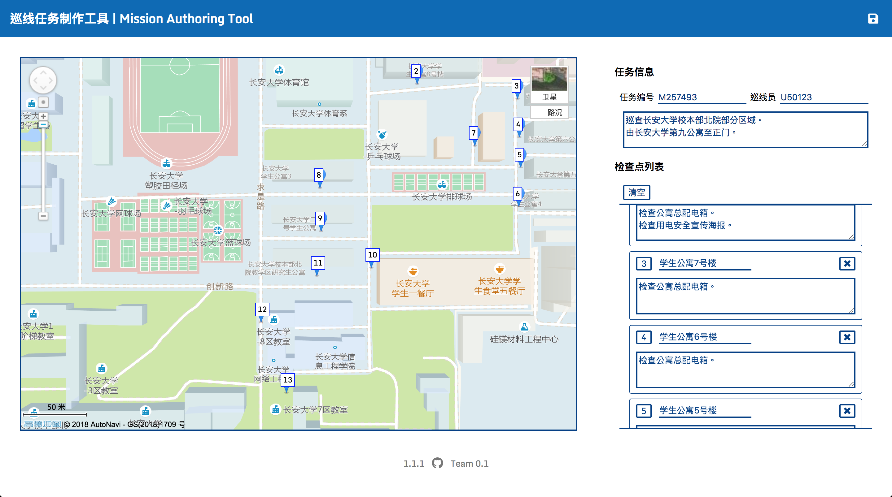
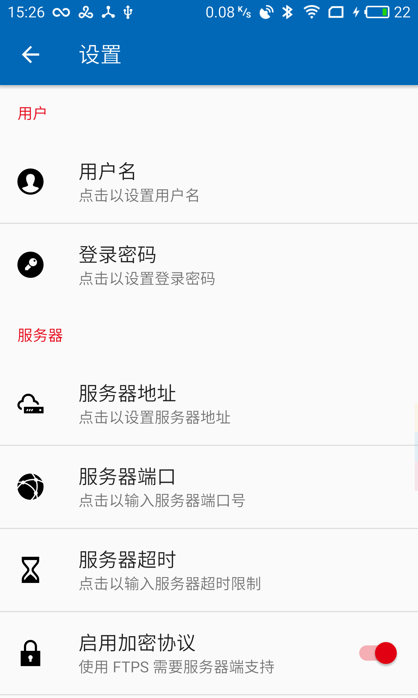

<a href="https://github.com/lucka-me/Patroute-web">

</a>

<h1 align=center>使用手册</h1>

    日期：2018年8月7日 
    版本：1.4

## 前言
巡线 Patroute 是为管线巡检工作提供的，集巡检任务管理和巡线工作管理于一体的智能化管理系统。本手册旨在阐明该产品系统的组成及使用方法，为用户正确、合理的使用本产品提供必要的技术资料。

## 目录
- [软件概述](#软件概述)
    - [适用版本](#适用版本)
    - [系统要求](#系统要求)
    - [经过测试的浏览器和设备](#经过测试的浏览器和设备)
- [用户界面](#用户界面)
    - [Android 客户端](#Android-客户端)
    - [设置界面](#设置界面)
- [安装与部署](#安装与部署)
    - [FTP 服务器](#FTP-服务器)
    - [Web 工具](Web-工具)
    - [Android 客户端](Android-客户端)
- [使用流程](#使用流程)
    - [发布任务](#发布任务)
    - [执行任务](#执行任务)
    - [审核任务](#审核任务)

## 软件概述
巡线 Patroute 系统（以下简称 **Patroute**）由 FTP 服务器、Web 工具及 Android 客户端组成，其基本功能如下：

* FTP 服务器：存储巡线任务数据和文件。
* Web 工具：制作巡线任务和审核任务日志，由管理员使用。
* Android 客户端：获取巡线任务、管理巡线工作、生成和提交工单报告及记录和上传任务日志，由巡检员使用。

### 适用版本
本手册为当前最新版本软件编写，适用的软件版本如下：

| 名称 | 版本号
| :---: | :---
| 任务制作工具（Web） | `1.1.1`
| 任务审核工具（Web） | `1.0.2`
| Android 客户端 | `1.4.2`

### 系统要求
使用 Patroute 需要满足以下要求：

| 名称 | 系统要求
| :---: | :---
| Web 工具 | 支持 HTML 5 及 CSS 3 的现代浏览器 互联网连接
| Android 客户端 | Android 5.0 或更高 互联网连接 GNSS 定位模块 摄像头 4GB 或以上存储空间

### 经过测试的浏览器和设备
以下浏览器和设备经测试可以正常运行 Patroute：

| 浏览器 | 版本 |
| :---: | :---:
| Safari | 11
| Chrome | 67

| 设备型号 | 系统版本 |
| :---: | :---:
| 华为 G7 Plus | Android 6.0.1 EMUI 4.0.2
| 魅族 MX4 Pro | Android 5.1.1 Flyme 6.3.0.2A

## 用户界面

### Web 工具
Patroute 的 Web 工具界面为两栏模式，左侧为地图视图，右侧为信息栏视图。

### Android 客户端
Patroute 的 Android 客户端界面简洁，采用标准的 Material Design 风格设计，主要包括主界面和设置界面。

| 主界面（显示地图） | 设置界面（部分）
| :---: | :---:
|  | 

主界面由工具栏、列表视图及报告按钮组成。其中列表视图由以下三种卡片组成：

- **位置卡片**  
  始终显示。卡片内显示设备当前所在的经纬度或地图。
- **任务卡片**  
  仅在开始载入任务、任务正在进行时显示。当正在载入任务时卡片内显示载入动画；当任务正在进行时则显示任务进度，点击卡片将打开显示任务详情的对话框。
- **检查点卡片**  
  仅在任务正在进行时显示。卡片内显示检查点名称、距离和完成状态，点击卡片将打开显示检查点详情的对话框。

设置界面包括对软件各项参数的设置，包括以下类别和项目：

- **用户**：用户名、登陆密码
- **服务器**：服务器地址、服务器端口、服务器超时、启用加密协议、测试服务器
- **地图**：显示地图、地图类型

## 安装与部署
在使用 Patroute 前，必须安装和部署服务器、Web 工具和 Android 客户端。

### FTP 服务器
Patroute 支持标准的 FTP 服务器。用户可根据自身需求架设服务器，亦可使用 Python 和 pyftpdlib 架设测试用服务器。

服务器根目录下应有 `Mission` 文件夹，以及对应各个用户的用户名文件夹。

### Web 工具
Web 工具为独立网页应用，将文件夹拷贝至 HTTP 服务器即可通过浏览器访问。

### Android 客户端
将 APK 安装包分发至符合要求的目标设备上安装即可。

首次运行软件时应在设置界面中按系统管理员的要求设置用户名和密码、服务器地址、端口、超时和加密协议并测试服务器，若测试失败请联系管理员。

**针对 Android 6.0 或更高版本的设备：本软件首次运行时将请求位置权限及外部存储权限，用户应同意，否则软件将无法正确运行。**

## 使用流程
使用 Patroute 配合巡线工作需要遵循一定的使用流程。本系统主要面向巡线管理者及巡线工作者，以下分别简称为管理员和用户。

### 发布任务
管理员可使用 Web 工具中的 **巡线任务制作工具** 直接生成任务文件：

1. 填写任务编号、巡线员工用户名及任务描述。
2. 在地图上依次单击检查点所在位置。
3. 在列表卡片中填写各个检查点名称及描述。
4. 检查无误后，点击右上角的保持按钮，生成任务文件压缩包。

将任务文件解压至 FTP 服务器根目录，与 `Mission` 文件夹合并即可。

最后在 FTP 服务器根目录下建立 `<用户名>/<任务 ID>/` 文件夹供用户上传照片、报告和日志。

### 执行任务
用户在主页面菜单中点击「开始」，客户端随即连接服务器下载并解析任务文件。

报告按钮会在任务进行期间显示，点击它将打开系统相机软件，用户可在现场拍照，拍照后将返回客户端并打开报告对话框，用户可添加问题描述并提交报告，上传期间悬浮按钮会显示上传状态。

本应用会以一定频率更新位置信息，用户应保持设备有良好的 GPS 信号（暂不支持通过网络定位）。在接近检查点时将弹出提示框提示用户检查，用户可选择正常或报告，两者均视为检查完毕，后者将打开相机进入报告问题的流程。  
若软件未弹出提示框，用户也可点击相应的检查点卡片以完成检查。  
任务进行时的位置更新、检查操作和提交报告均会被录入日志文件。

用户在发现问题时可随时点击界面右下角的悬浮按钮打开系统照相机拍照，确认照片后将返回本软件页面并显示问题报告对话框，用户可添加问题描述并提交报告，软件将生成和上传报告文件 `ISS_<任务 ID>_<报告序列号>.txt` 和照片。

当全部检查点均检查完毕后，任务对话框将弹出，用户可以选择结束任务。结束任务时软件将生成并上传任务日志文件 `<任务 ID>.log`。用户亦可随时在主页面菜单及任务对话框中结束任务。

### 审核任务
管理员可通过 Web 工具中的 **巡线任务审核工具** 对任务日志文件进行审核。

Patroute 的日志模块会记录任务执行期间的信息，包括移动轨迹、检查记录、提交工单、运行情况、TrumeKit 检测到的模拟位置和时间欺骗及其对应的时间和位置。管理员可在审核工具中点击右上角的按钮打开 `.log` 文件，工具将解析日志内容，将其以地图和列表的形式展现出来。
